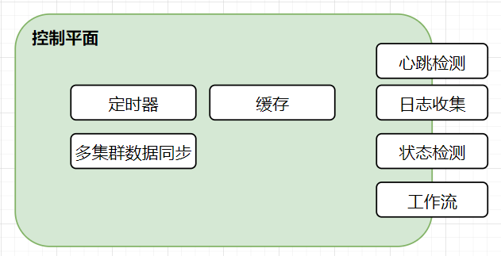

# Sylvia-Doc
Sylvia Project Link：[Sylvia](https://github.com/FOXFOUND/Sylvia) 

Sylvia-Doc English Version：[README-EN.md](README-EN.md) 

## Sylvia功能

面向边缘计算的作业平台，具备如下功能
```
管理平面：
  |- 多集群同步/高可用
边缘节点：
  |- 批处理任务
  |- 作业调度
  |- 状态检查/日志上报（第二版）
```

## Sylvia架构(草稿状态)

技术栈：Golang/Python

通信方式：Rest API/GRPC

数据存储：K8S CRD/PVC

缓存：Redis

### 管理平面：



作为Sylvia的控制层，其具备数个与边缘节点交互的能力：
 
 - 心跳检测：
 ```
 边缘节点进程的存活心跳检测
 ```
 - 日志收集
 ```
 边缘客户端主程式的执行日志
 作业执行结果的记录收集
 ```
- 状态检测
```
边缘客户端主程式的状态
作业执行状态收集
```
- 工作流
```
作业执行调度策略
```
在Sylvia管理平面内存在若干模块：
- 定时器
```
定时类型的作业任务的调度
```
- 缓存
```
对热点数据的缓存
```
- 多集群数据同步
```
多中心/异地Sylvia控制节点间的数据同步
```

### 边缘节点：

Sylvia将边缘节点划分如下两种模式：

#### 裸机模式：


裸机模式：边缘客户端主进程执行在传统VM、PM主机中，通过该主进程Fork新的Sub进程以实现。

#### 容器(基于K8S)模式：


容器模式：边缘客户端主进程为Kubernetes集群中的一个Deployment，该工作负载具备对应NS下所有资源的操作权限。

当新的作业需求过来时，将以Pod形式在该NS下执行。
